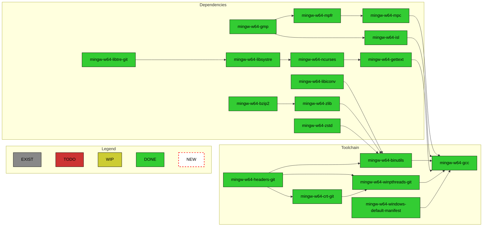
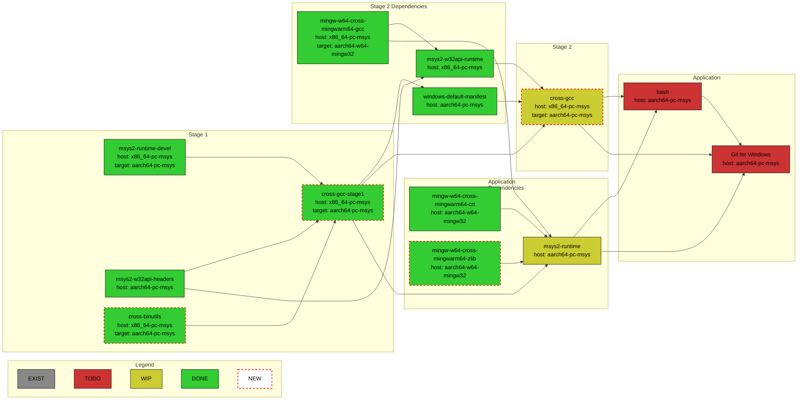

# MSYS2 WoArm64 Packages Build and Repository

This repository contains GitHub Actions workflows for building MinGW and MSYS2 toolchains
with `aarch64-w64-mingw32` and `aarch64-pc-msys` targets inside MSYS2 environment and deploys
their Pacman packages overlay repositories to GitHub Pages environment of this repository.
It also serves as a documentation of the necessary steps to build them.

The actual MSYS2 packages recipes dwells in `woarm64` branches of
[Windows-on-ARM-Experiments/MSYS2-packages](https://github.com/Windows-on-ARM-Experiments/MSYS2-packages)
repository. Please report any issue related to packages build to this repository's
[issues list](https://github.com/Windows-on-ARM-Experiments/msys2-woarm64-build/issues).
The actual GCC, binutils, and MinGW source codes with the necessary `aarch64-w64-mingw32` target
changes are located at [Windows-on-ARM-Experiments/gcc-woarm64](https://github.com/Windows-on-ARM-Experiments/gcc-woarm64),
[Windows-on-ARM-Experiments/binutils-woarm64](https://github.com/Windows-on-ARM-Experiments/binutils-woarm64),
and [Windows-on-ARM-Experiments/mingw-woarm64](https://github.com/Windows-on-ARM-Experiments/mingw-woarm64),
resp. Please report any issues related to outputs of the toolchain binaries to
[Windows-on-ARM-Experiments/mingw-woarm64-build](https://github.com/Windows-on-ARM-Experiments/mingw-woarm64-build)
repository's
[issues list](https://github.com/Windows-on-ARM-Experiments/mingw-woarm64-build/issues).

## Packages Repository Usage

Add the following to the `/etc/pacman.conf` before any other package repositories specification:

```ini
[woarm64]
Server = https://windows-on-arm-experiments.github.io/msys2-woarm64-build/$arch
SigLevel = Optional
```

Run:

```bash
pacman -Sy
```

to update packages definitions.

Run:

```bash
pacman -S mingw-w64-cross-mingwarm64-gcc
```

to install `x86_64-pc-msys` host MinGW cross toolchain with `aarch64-w64-mingw32` target support.

## Building Packages Locally

In case one would like to build all the cross-compilation toolchain packages locally, there is
a `build.sh` script. It expects that the
[Windows-on-ARM-Experiments/MSYS2-packages](https://github.com/Windows-on-ARM-Experiments/MSYS2-packages)
package recipes repository is already cloned in the parent folder of this repository's folder and
it must be executed from `MSYS` environment.

## MingGW Cross-Compilation Toolchain CI

The [mingw-cross-toolchain.yml](https://github.com/Windows-on-ARM-Experiments/msys2-woarm64-build/blob/main/.github/workflows/mingw-cross-toolchain.yml)
workflow builds `x86_64-pc-msys` host, `aarch64-w64-mingw32` target cross-compilation toolchain packages:

```mermaid
%%{init: {"flowchart": {"htmlLabels": false, 'nodeSpacing': 30, 'rankSpacing': 30}} }%%
flowchart LR
    classDef EXIST fill:#888,color:#000,stroke:#000
    classDef DONE fill:#3c3,color:#000,stroke:#000
    classDef NEW_DONE fill:#3c3,color:#000,stroke:#f00,stroke-width:2,stroke-dasharray:5
    classDef WIP fill:#cc3,color:#000,stroke:#000
    classDef NEW_WIP fill:#cc3,color:#000,stroke:#f00,stroke-width:2,stroke-dasharray:5
    classDef TODO fill:#c33,color:#000,stroke:#000
    classDef NEW_TODO fill:#c33,color:#000,stroke:#f00,stroke-width:2,stroke-dasharray:5
    classDef NEW fill:#fff,color:#000,stroke:#f00,stroke-width:2,stroke-dasharray:5

    subgraph Legend
      direction LR 
      EXIST:::EXIST ~~~ TODO:::TODO ~~~ WIP:::WIP ~~~ DONE:::DONE ~~~ NEW:::NEW
    end

    mingw-w64-cross-mingwarm64-headers["`
        mingw-w64-mingwarm64-headers
        host: aarch64-w64-mingw32
    `"]:::DONE

    mingw-w64-cross-mingwarm64-binutils["`
        mingw-w64-cross-binutils
        host: x86_64-pc-msys
        target: aarch64-w64-mingw32
    `"]:::DONE

    mingw-w64-cross-mingwarm64-gcc-stage1["`
        mingw-w64-cross-mingwarm64-gcc-stage1
        host: x86_64-pc-msys
        target: aarch64-w64-mingw32
    `"]:::NEW_DONE

    mingw-w64-cross-mingwarm64-crt["`
        mingw-w64-cross-mingwarm64-crt
        host: aarch64-w64-mingw32
    `"]:::DONE

    mingw-w64-cross-mingwarm64-windows-default-manifest["`
        mingw-w64-cross-windows-default-manifest
        host: aarch64-w64-mingw32
    `"]:::DONE

    mingw-w64-cross-mingwarm64-winpthreads["`
        mingw-w64-cross-mingwarm64-winpthreads
        host: aarch64-w64-mingw32
    `"]:::DONE

    mingw-w64-cross-mingwarm64-gcc["`
        mingw-w64-cross-mingwarm64-gcc
        host: x86_64-pc-msys
        target: aarch64-w64-mingw32
    `"]:::DONE

    mingw-w64-cross-mingwarm64-zlib["`
        mingw-w64-cross-mingwarm64-zlib
        host: aarch64-w64-mingw32
    `"]:::NEW_DONE

    subgraph Toolchain
        mingw-w64-cross-mingwarm64-headers --> mingw-w64-cross-mingwarm64-binutils
        mingw-w64-cross-mingwarm64-headers --> mingw-w64-cross-mingwarm64-crt
        mingw-w64-cross-mingwarm64-headers --> mingw-w64-cross-mingwarm64-winpthreads

        mingw-w64-cross-mingwarm64-binutils --> mingw-w64-cross-mingwarm64-gcc-stage1
        
        mingw-w64-cross-mingwarm64-gcc-stage1 --> mingw-w64-cross-mingwarm64-crt
        mingw-w64-cross-mingwarm64-gcc-stage1 --> mingw-w64-cross-mingwarm64-windows-default-manifest
        
        mingw-w64-cross-mingwarm64-crt --> mingw-w64-cross-mingwarm64-winpthreads
        mingw-w64-cross-mingwarm64-winpthreads --> mingw-w64-cross-mingwarm64-gcc
        mingw-w64-cross-mingwarm64-windows-default-manifest --> mingw-w64-cross-mingwarm64-gcc
    end

    subgraph Software
        mingw-w64-cross-mingwarm64-gcc --> mingw-w64-cross-mingwarm64-zlib 
    end
```



## MinGW Native Toolchain CI

The [mingw-native-toolchain.yml](https://github.com/Windows-on-ARM-Experiments/msys2-woarm64-build/blob/native-mingw-toolchain/.github/workflows/mingw-native-toolchain.yml)
workflow builds native `aarch64-w64-mingw32` toolchain packages:



## MSYS2/Cygwin Toolchain Porting

Work on native `aarch64-pc-msys`, resp. `aarch64-pc-cygwin`, toolchain is in progress.
First iteration taken is to provide `x86_64-pc-msys` host, `aarch64-pc-msys` target cross-toolchain
that will then eventually build the `aarch64-pc-msys` native toolchain. The current status of the
cross-toolchain can be visualized by the following chart:



## Detailed MSYS2 Toolchian Packages Dependencies Chart

Relevant for `x86-64-pc-msys` host, `aarch64-pc-msys` and `aarch64-w64-mingw32`  target 
cross-compilation option:

```mermaid
%%{init: {"flowchart": {"htmlLabels": false, 'nodeSpacing': 30, 'rankSpacing': 30}} }%%
flowchart LR
    classDef EXIST fill:#888,color:#000,stroke:#000
    classDef DONE fill:#3c3,color:#000,stroke:#000
    classDef NEW_DONE fill:#3c3,color:#000,stroke:#f00,stroke-width:2,stroke-dasharray:5
    classDef WIP fill:#cc3,color:#000,stroke:#000
    classDef NEW_WIP fill:#cc3,color:#000,stroke:#f00,stroke-width:2,stroke-dasharray:5
    classDef TODO fill:#c33,color:#000,stroke:#000
    classDef NEW_TODO fill:#c33,color:#000,stroke:#f00,stroke-width:2,stroke-dasharray:5
    classDef NEW fill:#fff,color:#000,stroke:#f00,stroke-width:2,stroke-dasharray:5

    subgraph Legend
      direction LR 
      EXIST:::EXIST ~~~ TODO:::TODO ~~~ WIP:::WIP ~~~ DONE:::DONE ~~~  NEW:::NEW
    end

    binutils["`
        binutils
        host: x86_64-pc-msys
        target: x86_64-pc-msys
    `"]:::EXIST

    gcc["`
        gcc
        host: x86_64-pc-msys
        target: x86_64-pc-msys
    `"]:::EXIST

    msys2-runtime-devel["`
        msys2-runtime-devel
        host: x86_64-pc-msys
        target: aarch64-pc-msys
    `"]:::DONE

    mingw-w64-cross-mingwarm64-binutils["`
        mingw-w64-cross-mingwarm64-binutils
        host: x86_64-pc-msys
        target: aarch64-w64-mingw32
    `"]:::DONE
    
    mingw-w64-cross-mingwarm64-gcc["`
        mingw-w64-cross-mingwarm64-gcc
        host: x86_64-pc-msys
        target: aarch64-w64-mingw32
    `"]:::DONE

    mingw-w64-cross-mingwarm64-gcc-stage1["`
        mingw-w64-cross-mingwarm64-gcc-stage1
        host: x86_64-pc-msys
        target: aarch64-w64-mingw32
    `"]:::NEW_DONE

    mingw-w64-cross-mingwarm64-crt["`
        mingw-w64-cross-mingwarm64-crt
        host: aarch64-w64-mingw32
    `"]:::DONE

    mingw-w64-cross-mingwarm64-headers["`
        mingw-w64-cross-mingwarm64-headers
        host: aarch64-w64-mingw32
    `"]:::DONE

    mingw-w64-cross-mingwarm64-winpthreads["`
        mingw-w64-cross-mingwarm64-winpthreads
        host: aarch64-w64-mingw32
    `"]:::DONE

    mingw-w64-cross-mingwarm64-windows-default-manifest["`
        mingw-w64-cross-mingwarm64-windows-default-manifest
        host: aarch64-w64-mingw32
    `"]:::DONE

    mingw-w64-cross-mingwarm64-zlib["`
        mingw-w64-cross-mingwarm64-zlib
        host: aarch64-w64-mingw32
    `"]:::NEW_DONE

    msys2-w32api-headers["`
        msys2-w32api-headers
        host: aarch64-pc-msys
    `"]:::DONE

    msys2-w32api-runtime["`
        msys2-w32api-runtime
        host: x86_64-pc-msys
    `"]:::DONE

    cross-binutils["`
        cross-binutils
        host: x86_64-pc-msys
        target: aarch64-pc-msys
    `"]:::NEW_DONE

    cross-gcc-stage1["`
        cross-gcc-stage1
        host: x86_64-pc-msys
        target: aarch64-pc-msys
    `"]:::NEW_DONE

    cross-gcc["`
        cross-gcc
        host: x86_64-pc-msys
        target: aarch64-pc-msys
    `"]:::NEW_WIP

    windows-default-manifest["`
        windows-default-manifest
        host: aarch64-pc-msys
    `"]:::DONE

    msys2-runtime["`
        msys2-runtime
        host: aarch64-pc-msys
    `"]:::WIP

    bash["`
       bash
       host: aarch64-pc-msys
    `"]:::TODO

    git4win["`
       Git for Windows
       host: aarch64-pc-msys
    `"]:::TODO

    subgraph Bootstrap
        direction TB
        binutils --> gcc
    end
    
    subgraph MinGW
        subgraph Stage 1
            mingw-w64-cross-mingwarm64-headers --> mingw-w64-cross-mingwarm64-binutils
            gcc --> mingw-w64-cross-mingwarm64-binutils

            mingw-w64-cross-mingwarm64-headers --> mingw-w64-cross-mingwarm64-gcc-stage1
            mingw-w64-cross-mingwarm64-binutils --> mingw-w64-cross-mingwarm64-gcc-stage1
            gcc --> mingw-w64-cross-mingwarm64-gcc-stage1
        end

        subgraph Stage 2\nDependencies
            mingw-w64-cross-mingwarm64-headers --> mingw-w64-cross-mingwarm64-crt
            mingw-w64-cross-mingwarm64-gcc-stage1 --> mingw-w64-cross-mingwarm64-crt
            
            mingw-w64-cross-mingwarm64-headers --> mingw-w64-cross-mingwarm64-winpthreads
            mingw-w64-cross-mingwarm64-gcc-stage1 --> mingw-w64-cross-mingwarm64-winpthreads
            mingw-w64-cross-mingwarm64-crt --> mingw-w64-cross-mingwarm64-winpthreads

            mingw-w64-cross-mingwarm64-gcc-stage1 --> mingw-w64-cross-mingwarm64-windows-default-manifest
        end

        subgraph Stage 2
            mingw-w64-cross-mingwarm64-headers --> mingw-w64-cross-mingwarm64-gcc
            mingw-w64-cross-mingwarm64-crt --> mingw-w64-cross-mingwarm64-gcc
            mingw-w64-cross-mingwarm64-winpthreads --> mingw-w64-cross-mingwarm64-gcc
            mingw-w64-cross-mingwarm64-windows-default-manifest --> mingw-w64-cross-mingwarm64-gcc
            mingw-w64-cross-mingwarm64-gcc-stage1 --> mingw-w64-cross-mingwarm64-gcc
            gcc --> mingw-w64-cross-mingwarm64-gcc
        end

        subgraph MINGW Software
            mingw-w64-cross-mingwarm64-gcc --> mingw-w64-cross-mingwarm64-zlib
        end
    end

    subgraph MSYS2
        subgraph Stage 1
             gcc --> msys2-runtime-devel

             gcc --> cross-binutils

             msys2-w32api-headers --> cross-gcc-stage1
             msys2-runtime-devel --> cross-gcc-stage1
             cross-binutils --> cross-gcc-stage1
             gcc --> cross-gcc-stage1
        end

        subgraph Stage 2 Dependencies
            msys2-w32api-headers --> msys2-w32api-runtime
            mingw-w64-cross-mingwarm64-gcc --> msys2-w32api-runtime

            cross-gcc-stage1 --> windows-default-manifest

            mingw-w64-cross-mingwarm64-gcc --> msys2-runtime
            mingw-w64-cross-mingwarm64-zlib --> msys2-runtime
            cross-gcc-stage1 --> msys2-runtime
        end

        subgraph Stage 2
            cross-gcc-stage1 --> cross-gcc
            msys2-w32api-runtime --> cross-gcc
            msys2-runtime --> cross-gcc
            windows-default-manifest --> cross-gcc
        end

        subgraph MSYS2 Application
            cross-gcc --> bash
            msys2-runtime --> bash

            cross-gcc --> git4win
            msys2-runtime --> git4win
            bash --> git4win
        end
    end
```


