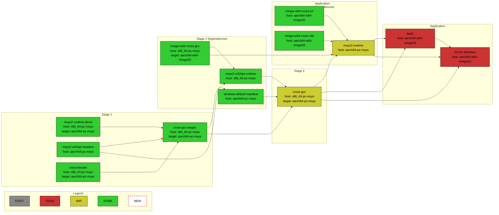

# MSYS2 WoArm64 Packages Build and Repository

This repository contains GitHub Actions workflows for building MinGW and MSYS2 toolchains
with `aarch64-w64-mingw32` and `aarch64-pc-msys` targets inside MSYS2 environment and as deploys
their Pacman packages repository overlay to GitHub Pages environment of this repository. It also
serves as a documentation of the necessary steps to build them.

The MSYS2 packages recipes dwells in
[Windows-on-ARM-Experiments/MSYS2-packages](https://github.com/Windows-on-ARM-Experiments/MSYS2-packages)
repository. Please report any issue related to packages build to this repository's issues though.
The actual GCC, binutils, and MinGW source code with the necessary `aarch64-w64-mingw32` target
changes are located at [ZacWalk/gcc-woarm64](https://github.com/ZacWalk/gcc-woarm64),
[ZacWalk/binutils-woarm64](https://github.com/ZacWalk/binutils-woarm64),
and [ZacWalk/mingw-woarm64](https://github.com/ZacWalk/mingw-woarm64), resp. Please report
any issues related to outputs of the toolchain binaries to
[ZacWalk/mingw-woarm64-build](https://github.com/ZacWalk/mingw-woarm64-build) repository's issues
though.

## Packages Repository Usage

Add the following to the `/etc/pacman.conf` before any other package repository specification:

```ini
[woarm64]
Server = https://windows-on-arm-experiments.github.io/msys2-woarm64-build/$arch
SigLevel = Optional
```

Run:

```bash
pacman -Sy
```

to update packages definitions.

Run:

```bash
pacman -S mingw-w64-cross-gcc
```

to install x64 host MinGW compiler with `aarch64-w64-mingw32` target support.

## Building Packages Locally

In case one would like to build all the packages locally, there is a `build.sh` script. It expects
that all the dependency repositories are cloned in the parent folder of this repository's folder.

## Dependencies Chart

The color of the blocks indicates whether the package recipes exist and/or succeed to build
and install. It does not reflect whether they actually work or do not contain severe bugs
to resolve.

```mermaid
%%{init: {"flowchart": {"htmlLabels": false, 'nodeSpacing': 30, 'rankSpacing': 30}} }%%
flowchart LR
    classDef EXIST fill:#888,color:#000,stroke:#000
    classDef DONE fill:#3c3,color:#000,stroke:#000
    classDef NEW_DONE fill:#3c3,color:#000,stroke:#f00,stroke-width:2,stroke-dasharray:5
    classDef WIP fill:#cc3,color:#000,stroke:#000
    classDef NEW_WIP fill:#cc3,color:#000,stroke:#f00,stroke-width:2,stroke-dasharray:5
    classDef TODO fill:#c33,color:#000,stroke:#000
    classDef NEW_TODO fill:#c33,color:#000,stroke:#f00,stroke-width:2,stroke-dasharray:5
    classDef NEW fill:#fff,color:#000,stroke:#f00,stroke-width:2,stroke-dasharray:5

    subgraph Legend
      direction LR 
      EXIST:::EXIST ~~~ TODO:::TODO ~~~ WIP:::WIP ~~~ DONE:::DONE ~~~  NEW:::NEW
    end

    binutils["`
        binutils
        host: x86_64-pc-msys
        target: x86_64-pc-msys
    `"]:::EXIST

    gcc["`
        gcc
        host: x86_64-pc-msys
        target: x86_64-pc-msys
    `"]:::EXIST

    msys2-runtime-devel["`
        msys2-runtime-devel
        host: x86_64-pc-msys
        target: aarch64-pc-msys
    `"]:::DONE

    mingw-w64-cross-binutils["`
        mingw-w64-cross-binutils
        host: x86_64-pc-msys
        target: aarch64-w64-mingw32
    `"]:::DONE
    
    mingw-w64-cross-gcc["`
        mingw-w64-cross-gcc
        host: x86_64-pc-msys
        target: aarch64-w64-mingw32
    `"]:::DONE

    mingw-w64-cross-gcc-stage1["`
        mingw-w64-cross-gcc-stage1
        host: x86_64-pc-msys
        target: aarch64-w64-mingw32
    `"]:::DONE

    mingw-w64-cross-crt["`
        mingw-w64-cross-crt
        host: aarch64-w64-mingw32
    `"]:::DONE

    mingw-w64-cross-headers["`
        mingw-w64-cross-headers
        host: aarch64-w64-mingw32
    `"]:::DONE

    mingw-w64-cross-winpthreads["`
        mingw-w64-cross-winpthreads
        host: aarch64-w64-mingw32
    `"]:::DONE

    mingw-w64-cross-windows-default-manifest["`
        mingw-w64-cross-windows-default-manifest
        host: aarch64-w64-mingw32
    `"]:::DONE

    mingw-w64-cross-zlib["`
        mingw-w64-cross-zlib
        host: aarch64-w64-mingw32
    `"]:::DONE

    msys2-w32api-headers["`
        msys2-w32api-headers
        host: aarch64-pc-msys
    `"]:::DONE

    msys2-w32api-runtime["`
        msys2-w32api-runtime
        host: x86_64-pc-msys
    `"]:::DONE

    cross-binutils["`
        cross-binutils
        host: x86_64-pc-msys
        target: aarch64-pc-msys
    `"]:::DONE

    cross-gcc-stage1["`
        cross-gcc-stage1
        host: x86_64-pc-msys
        target: aarch64-pc-msys
    `"]:::DONE

    cross-gcc["`
        cross-gcc
        host: x86_64-pc-msys
        target: aarch64-pc-msys
    `"]:::WIP

    windows-default-manifest["`
        windows-default-manifest
        host: aarch64-pc-msys
    `"]:::DONE

    msys2-runtime["`
        msys2-runtime
        host: aarch64-pc-msys
    `"]:::WIP

    bash["`
       bash
       host: aarch64-w64-mingw32 
    `"]:::TODO

    git4win["`
       Git for Windows
       host: aarch64-w64-mingw32 
    `"]:::TODO

    subgraph Bootstrap
        direction TB
        binutils --> gcc
    end
    
    subgraph MinGW
        subgraph Stage 1
            gcc --> mingw-w64-cross-binutils

            gcc --> mingw-w64-cross-gcc-stage1
            mingw-w64-cross-binutils --> mingw-w64-cross-gcc-stage1
            mingw-w64-cross-headers --> mingw-w64-cross-gcc-stage1
        end

        subgraph Stage 2\nDependencies
            mingw-w64-cross-gcc-stage1 --> mingw-w64-cross-crt
            mingw-w64-cross-binutils --> mingw-w64-cross-crt
            mingw-w64-cross-headers --> mingw-w64-cross-crt
            
            mingw-w64-cross-gcc-stage1 --> mingw-w64-cross-winpthreads
            mingw-w64-cross-binutils --> mingw-w64-cross-winpthreads
            mingw-w64-cross-crt --> mingw-w64-cross-winpthreads
            mingw-w64-cross-headers --> mingw-w64-cross-winpthreads

            mingw-w64-cross-gcc-stage1 --> mingw-w64-cross-windows-default-manifest
            mingw-w64-cross-binutils --> mingw-w64-cross-windows-default-manifest
        end

        subgraph Stage 2
            gcc --> mingw-w64-cross-gcc
            mingw-w64-cross-binutils --> mingw-w64-cross-gcc
            mingw-w64-cross-crt --> mingw-w64-cross-gcc
            mingw-w64-cross-headers --> mingw-w64-cross-gcc
            mingw-w64-cross-winpthreads --> mingw-w64-cross-gcc
            mingw-w64-cross-windows-default-manifest --> mingw-w64-cross-gcc

        end

        mingw-w64-cross-gcc --> mingw-w64-cross-zlib 
    end

    subgraph MSYS2
        subgraph Stage 1
             gcc --> msys2-runtime-devel

             gcc --> cross-binutils

             cross-binutils --> cross-gcc-stage1
             gcc --> cross-gcc-stage1
             msys2-runtime-devel --> cross-gcc-stage1
             msys2-w32api-headers --> cross-gcc-stage1
        end

        subgraph Stage 2 Dependencies
            mingw-w64-cross-gcc --> msys2-w32api-runtime 
            msys2-w32api-headers --> msys2-w32api-runtime 

            cross-gcc-stage1 --> windows-default-manifest
        end

        subgraph Stage 2
            cross-gcc-stage1 --> cross-gcc
            msys2-w32api-runtime --> cross-gcc
            windows-default-manifest --> cross-gcc
        end

        subgraph Application\nDependencies
            cross-gcc --> msys2-runtime
            mingw-w64-cross-gcc --> msys2-runtime
            mingw-w64-cross-crt --> msys2-runtime
            mingw-w64-cross-zlib --> msys2-runtime
        end

        subgraph Application
            cross-gcc --> bash
            msys2-runtime --> bash

            cross-gcc --> git4win
            msys2-runtime --> git4win
            bash --> git4win
        end
    end
```



## MingGW Toolchain CI

```mermaid
%%{init: {"flowchart": {"htmlLabels": false, 'nodeSpacing': 30, 'rankSpacing': 30}} }%%
flowchart LR
    classDef EXIST fill:#888,color:#000,stroke:#000
    classDef DONE fill:#3c3,color:#000,stroke:#000
    classDef NEW_DONE fill:#3c3,color:#000,stroke:#f00,stroke-width:2,stroke-dasharray:5
    classDef WIP fill:#cc3,color:#000,stroke:#000
    classDef NEW_WIP fill:#cc3,color:#000,stroke:#f00,stroke-width:2,stroke-dasharray:5
    classDef TODO fill:#c33,color:#000,stroke:#000
    classDef NEW_TODO fill:#c33,color:#000,stroke:#f00,stroke-width:2,stroke-dasharray:5
    classDef NEW fill:#fff,color:#000,stroke:#f00,stroke-width:2,stroke-dasharray:5

    subgraph Legend
      direction LR 
      EXIST:::EXIST ~~~ TODO:::TODO ~~~ WIP:::WIP ~~~ DONE:::DONE ~~~ NEW:::NEW
    end

    mingw-w64-cross-binutils["`
        mingw-w64-cross-binutils
        host: x86_64-pc-msys
        target: aarch64-w64-mingw32
    `"]:::DONE
    
    mingw-w64-cross-gcc["`
        mingw-w64-cross-gcc
        host: x86_64-pc-msys
        target: aarch64-w64-mingw32
    `"]:::DONE

    mingw-w64-cross-gcc-stage1["`
        mingw-w64-cross-gcc-stage1
        host: x86_64-pc-msys
        target: aarch64-w64-mingw32
    `"]:::DONE

    mingw-w64-cross-crt["`
        mingw-w64-cross-crt
        host: aarch64-w64-mingw32
    `"]:::DONE

    mingw-w64-cross-headers["`
        mingw-w64-cross-headers
        host: aarch64-w64-mingw32
    `"]:::DONE

    mingw-w64-cross-winpthreads["`
        mingw-w64-cross-winpthreads
        host: aarch64-w64-mingw32
    `"]:::DONE

    mingw-w64-cross-windows-default-manifest["`
        mingw-w64-cross-windows-default-manifest
        host: aarch64-w64-mingw32
    `"]:::DONE

    mingw-w64-cross-zlib["`
        mingw-w64-cross-zlib
        host: aarch64-w64-mingw32
    `"]:::TODO

    subgraph Stage 1
        mingw-w64-cross-binutils --> mingw-w64-cross-gcc-stage1
        mingw-w64-cross-headers --> mingw-w64-cross-gcc-stage1
    end

    subgraph Stage 2\nDependencies
        mingw-w64-cross-gcc-stage1 --> mingw-w64-cross-crt
        mingw-w64-cross-binutils --> mingw-w64-cross-crt
        mingw-w64-cross-headers --> mingw-w64-cross-crt
        
        mingw-w64-cross-gcc-stage1 --> mingw-w64-cross-winpthreads
        mingw-w64-cross-binutils --> mingw-w64-cross-winpthreads
        mingw-w64-cross-crt --> mingw-w64-cross-winpthreads
        mingw-w64-cross-headers --> mingw-w64-cross-winpthreads

        mingw-w64-cross-gcc-stage1 --> mingw-w64-cross-windows-default-manifest
        mingw-w64-cross-binutils --> mingw-w64-cross-windows-default-manifest
    end

    subgraph Stage 2
        mingw-w64-cross-binutils --> mingw-w64-cross-gcc
        mingw-w64-cross-crt --> mingw-w64-cross-gcc
        mingw-w64-cross-headers --> mingw-w64-cross-gcc
        mingw-w64-cross-winpthreads --> mingw-w64-cross-gcc
        mingw-w64-cross-windows-default-manifest --> mingw-w64-cross-gcc
    end

    subgraph Software
       mingw-w64-cross-gcc --> mingw-w64-cross-zlib 
    end  
```



## MSYS2 Toolchain CI

TODO

## MSYS2/Cygwin Toolchain Porting


